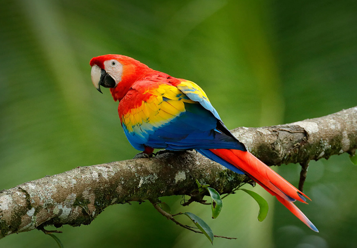
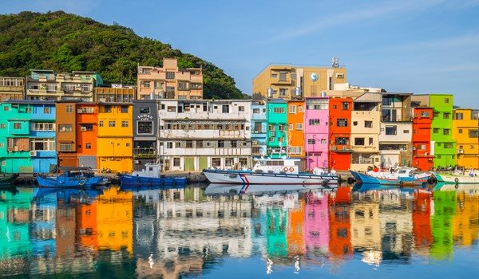
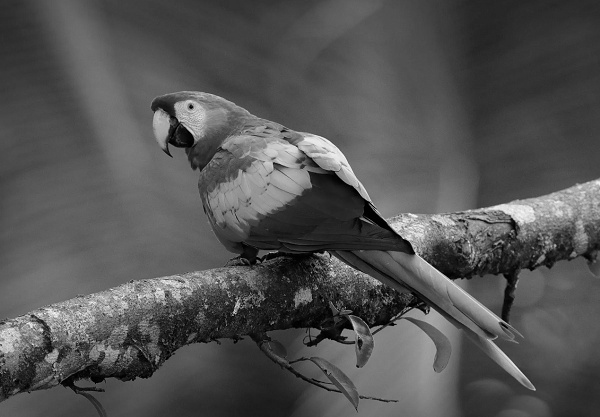
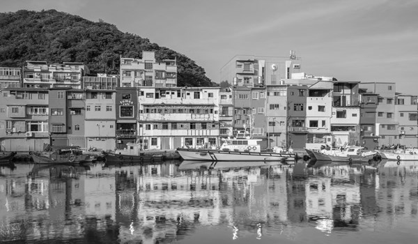

# 111590004 張意昌 MV_HW1

## Approach

> [!NOTE]  
> In this homework, our goal is learning some basic technique for image processing.  
> There are five problems to solve and each problem has different method to use.  
> In this report. I will answer each question and put original images and result for each question.

## Original Image

> [!TIP]  
> Here is our original pictures.

## Problem 1-1 Grayscale Image

> [!IMPORTANT]  
> In problem1-1, our goal is trying to convert an image to grayscale image.  
> Our formula is `0.3 * R + 0.59 * G + 0.11 * B`.  
> In my code, the solution function is `def rgb2gray(img)`.  
> First, we convert the parameter `img` to a numpy array.  
> Then revert the channel array since the origin array is (B,G,R) not (R,G,B).  
> Finally, we use the formula and turn back the parameter `ans`, this is our answer.  
> Funciton `def np2img(nparr,filename,folder = 'result_img')` can help us convert a numpy array to a jpg file.

> [!TIP]  
> Above is result images for this question.

## Problem 1-2 Binary Image

> [!IMPORTANT]  
> Our goal is try to build a binary image for this question.  
> Original images are come from problem1-1.

## Problem 1-3 Index Image
## Problem 2-1 Resizing Image
## Problem 2-2 Resizing Image with Interpolation