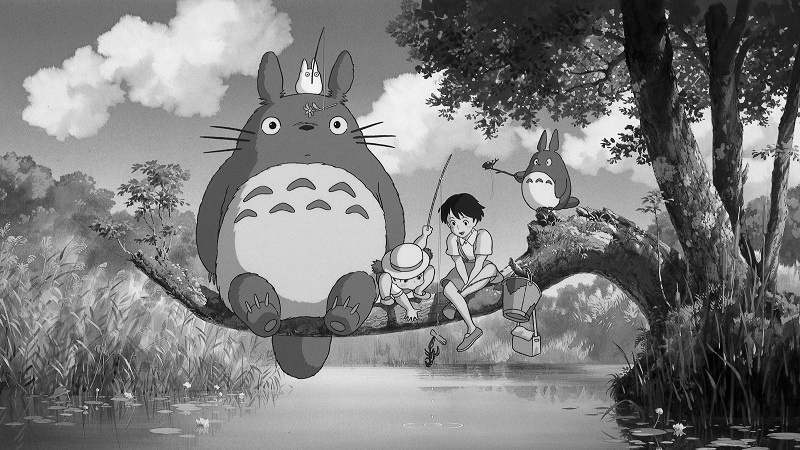
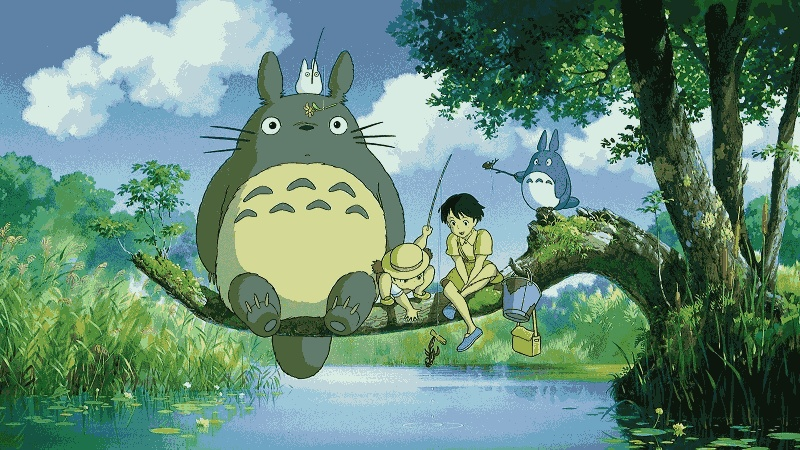
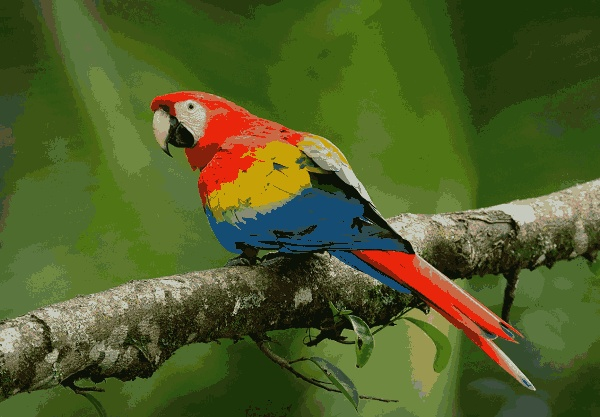
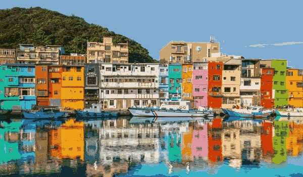

# 111590004 張意昌 MV_HW1

## Approach

> [!NOTE]  
> In this homework, our goal is learning some basic technique for image processing.  
> There are five problems to solve and each problem has different method to use.  
> In this report. I will answer each question and put original images and result for each question.

## Original Image

> [!TIP]  
> Here is our original pictures.
> 

## Problem 1-1 Grayscale Image

> [!IMPORTANT]  
> In problem1-1, our goal is trying to convert an image to a grayscale image.  
> Our formula is `0.3 * R + 0.59 * G + 0.11 * B`.  
> In my code, the solution function is `def rgb2gray(img)`.  
> First, we convert the parameter `img` to a numpy array.  
> Then revert the channel array since the origin array is (B,G,R) not (R,G,B).  
> Finally, we use the formula and turn back the parameter `ans`, this is our answer.  
> Funciton `def np2img(nparr,filename,folder = 'result_img')` can help us convert a numpy array to a jpg file.

> [!TIP]  
> Above is result images for this question.  
> I get three grayscale images by using the formula.

## Problem 1-2 Binary Image

> [!IMPORTANT]  
> Our goal is trying to build a binary image for this question.  
> Original images are come from problem1-1.  
> `def gray2bin(img,threshold = 128)` is the solution code for this problem.  
> First `img` is already a numpy array since we have the return value from problem1-1.  
> Threshold is `128` , when a color  is larger or equal to `128`, it will be `255`.  
> Otherwise, it will be `0` .
> I try to use `(img >= threshold).astype(np.uint8) * 255` for solution.  
> It will convert every pixel into true or false. Then convert boolean value to an integer.  
> If a pixel is `1` then it will be `255` ,since we have `*255` .

> [!TIP]  
> Above is result images for this question.  
> Here is three pictures for the problem.  
> I try to use larger than before.  
> But the result gets more white pixels in image.

## Problem 1-3 Index Image

> [!IMPORTANT]   
> For this part, we need to generate index image by the original image given from homework.  
> We need to define a `32` types color map and replace every color.  
> I will given approach for how I finish this problem below down the result images.  
> Given function is `def img2idximg(img)`.  Give a picture loaded by cv2 and it will return the answer by a numpy array.  
> I used `Median Cut` algorithm to make index image. It is a classic algorithm to generate an index image.  

> [!NOTE]  
> Here is three pictures for the result in this problem.  
> Why I choose `Median cut` ?  Before I choose this algorithm for generating picture, I try other ways.  
> First approach I tried is calculated and sorted all color by frequency then divided by `32` part.  
> Then calculate means for each part and choose means for color map.  
> This approach isn't the best solution beacause it generate the color darker then test image.  
> Second approach is same way but this time we just sorted by color value.  
> Also, this isn't good approach because it lose a lot of color then original image.  
> Finally, I try to use `Median cut`. It will choose median for each group and divided into `2` part until there is `32` group.  
> For every cut, it will calculate difference for each channel,sorted by the largest difference channel.  
> As the solution, it generate three index images and have a suitable color map.

## Problem 2-1 Resizing Image

> [!IMPOARANT]  
> In problem 2, we discussed the method to resize image.  
> In 2-1, we resize image without interpolation, a method to make color more smoothly.  
> The solution is `def scaleimg(img,scale)`, give `img` and `scale` for expect times.  
> It will give a numpy array after resizing.  

> [!NOTE]  
> Above is `2` times images, next is `1/2` times images. 

  
  

> [!CAUTION]  
> I will discuss difference and method below `2-2` .

## Problem 2-2 Resizing Image with Interpolation

> [!IMPOARANT]  
> In 2-2, we resize image with interpolation, a method to make color more smoothly.  
> I use bilinear interpolation since it is easier for implementation.  
> The solution is `def scaleimgwithinterp(img,scale)`, give `img` and `scale` for expect times.  
> It will give a numpy array after resizing.  
>

> [!NOTE]  
> Above is `2` times images, next is `1/2` times images. 

  
  

> [!IMPORTANT]  
> By two question and solution, now we discuss the method and difference.  
> For `2-1`, we just generate image by brute force.  
> It is just calculate the pixel where given image is then paste on new image.  
> In `2-2`, we include a method called interpolation, to make image smoothly.  
> The way is to find the region pixel for every origin pixel.  
> Then using weighted average to calculate new pixel value and put it into new image.  
> The most difference is there will be more smooth in every picture in `2-2`.  
> Such as the boundary for house,bird or boat. 

## My thought in hw1

> [!IMPORTANT]  
> In homework1, I learned some technique for image processing.  
> The most impressive part is problem1-3 and problem2.  
> For problem1-3, we need to choose a best method to generate an index image.  
> The index image we generated needs to be reconstructed using the palette in order to  
> restore the original colors as accurately as possible.  
> I came up with two approaches by myself, but the results are worse than the `Median Cut`, which is the final method I used.    
> While some classmates used K-means to solve this problem,  
> I preferred to use a different method to find other possible solutions.  
> In problem2, I obtain the smooth image for `2-2` by using interpolation.  
> The image generate without interpolation has a more blocky feel.  
> Both of them need a lot of time to generate a new image.  
> Since I add this two function into the main part of the code, it take almost a minute to run it.  
> I learn how to implement some technique to generate different image in this homework.  

# Report link

[Hw1](https://github.com/kesshoban3310/NTUT_Machine_Vision/tree/main/hw1)

> [!NOTE]  
> You can see origin link for this solution.  