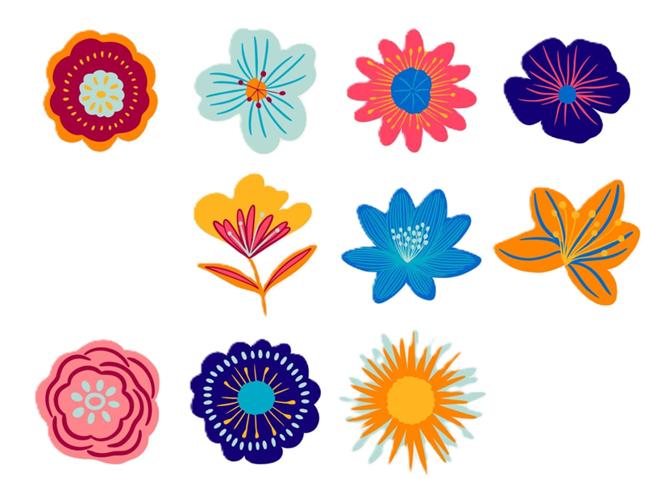
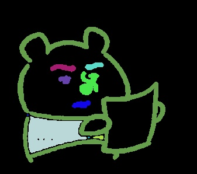
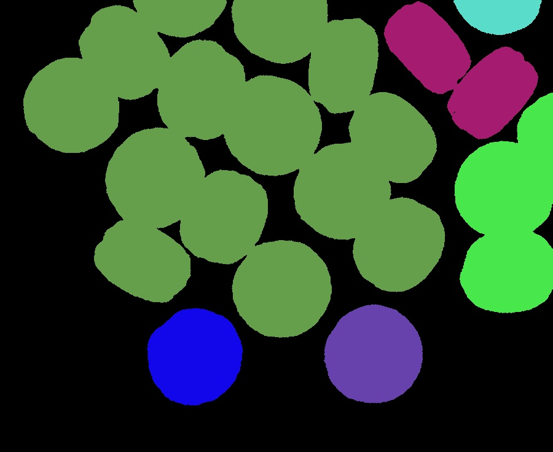

# 111590004 張意昌 MV_HW2

## Approach

> [!NOTE]  
> In this homework, our goal is learning some basic technique for counting and labeling object in image.  
> There are two problems to solve and some other method I used in this homework.  
> In this report. I will answer each question and put original images and result for each question.
> At the end of report. I will discuss some issue which I found in this homework.

## Original Image

> [!TIP]  
> Here is our original pictures.  
>   
> 
> 

## Problem 1 Labeling And Drawing Color

> [!IMPORTANT]  
> In this problem, we try to use 4-neighbor and 8-neighbor to labeling object.  
> Before labeling, we need to do some basic image processing.  
> As requirement, I convert the image into binary image.  
> But I try to do some process before I convert them.  
> Here is the reason and the following of the steps.  
> First, I try to convert to binary image using threshold `128`. (Follow by slide)  
> I found out that there is some noise and all the origin images have white backgrounds.  
> I calculate all the pixels and made a histogram for each image.  
> `def gray2his(img)` is the function to do this step.  
> After that I choose an adequate threshold for each image, stored in `threshold`.  
> But I define that if less than threshold will be `1`, otherwise it is `0` to filter white background.  
> Later on, I use shrinking and expanding method to remove noises.  
> The binary image after preprocess is adequate for labeling and coloring.  
> For color palette, I randomly choose `31` color and one for black.  
> So if you run the program, it might be different from the previous result.  
> Here is the 4-neighbor and 8-neighbor result.  

> [!TIP]  
> Because there are to more to talk.  
> I will introduce some steps for labeling.  
> Basic on the algorithm, I use the teacher teaches on the class.  
> By using the 4-neighbor or 8-neighbor masks, we can see the left、left-top、top pixels to decided the label.  
> More details are on the slides. I want to share that after labeling, we need to merge the label.  
> Because some of the labels lead to same object, but they are different numbers.  
> I use union and find algorithm to merge these label.  
> After that, the label counts are less than `32`.  
> That's why I choose `32` for the numbers of colors.  

### 4-neighbor result

>   
> 
> 

### 8-neighbor result

>   
> 
> 

> [!NOTE]  
> You can see there is a difference from img1 by using different mask.  
> I think there is a pixel that connected with other pixel by corner and caused the different result.  

## Problem 2 External And Internal Method For Counting Object

> [!IMPORTANT]  
> In this problem, we need to count object using the method mentioned on the class.  
> Which is using external and internal masks to calculate how many patterns on the image.  
> The masks define following rules.  
> For external mask, there is a 2x2 square and have three `0`s and one '1'.  
> For internal mask, there is a 2x2 square and have three `1`s and one '0'.  
> You can see the list in `def Objcounting(img)`, which show the definition of those two mask.  
> After defining these masks, we need to match all the patterns for the image.  
> Variable `e` denotes to the count of external patterns in the image.  
> Variable `i` denotes to the count of internal patterns in the image.  
> The result is `(e-i)/4`.  
> Here are the screenshot for the result.  

  
  

> [!NOTE]  
> You could see there are a significant difference between program and human eyes.  
> I think a special feature is that program will calculate every pixel one by one.  
> And when I zoom-in the picture, I found out that every boundary of objects isn't smoothly.  
> This might be effect the result of the counting algorithm.  

## My thought in hw2

> [!TIP]  
> In this section, I will discuss some interest things I found in hw2.  
> First, The image given this time is not a well done image.  
> We should do some processing to get a good binary image.  
> I use histogram to find threshold and shrinking、expanding method to filter the noises.  
> Second, I find out that there is a very different from machine and human eyes.  
> For knowing how many object in the picture, there are very big different.  
> For human eyes, they can recognize how many objects on a picture in a second.  
> But for a machine, we need to do many process to know this inform.  
> And it may not be correct. (For problem2 and problem1 img2)  
> Additionally, I think for img2, the boundary of each macarons need to be careful to separate.  
> So it may get better result from problem1.  
> Last, for this homework, I learned about how to implement the method taught in the class.  
> And also how to solve the problem by using these technique.  

# Report link

[HW2](https://github.com/kesshoban3310/NTUT_Machine_Vision/tree/main/hw2)

> [!NOTE]  
> You can see origin link for this solution.  