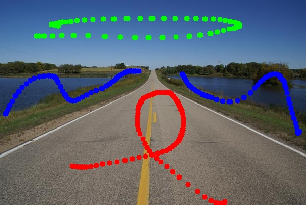
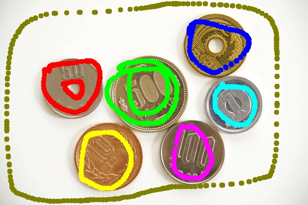
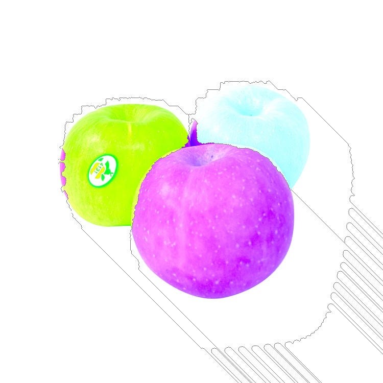
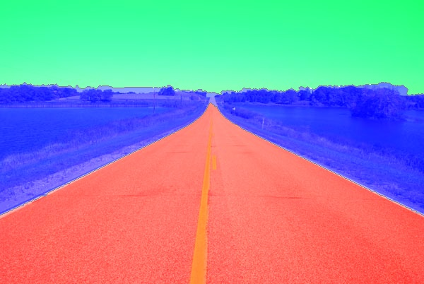

# 111590004 張意昌 MV_HW3

## Approach

> [!NOTE]  
> In this homework, our goal is using watershed algorithm to segment image.    
> There are two problems to solve in this homework.  
> In this report. I will answer each question and put original images and result for each question.  
> At the end of report. I will discuss some issue which I found in this homework.

## Original Image

> [!TIP]  
> Here is our original pictures.  
> 
> 
> 

## Problem 1 Mark the area you want to segment

> [!IMPORTANT]  
> In this problem, we need to use mouse to making mask.  
> The method is using mouse left click to make mask and number key to change the label colors.  
> After that, press Q or using right-top bottom to make mask for next picture.  
> For final processing in this problem,it will make two images here.  
> One is marked image and the other is mask image.  

### Marked Image

> [!TIP]  
> 
> 
> 

### Mask Image

> [!TIP]  
> 
> 
> 

## Problem 2 Watershed Segmentation & Region growing

> [!IMPORTANT]  
> In this problem, we need to use watershed algorithm to segment object.  
> Defining the priority is crucial.  
> Each image is first converted to grayscale.  
> Pixel priority is then determined by intensity:  
> the darker the pixel, the higher its priority.  
> After decided our priority, we could start to region growing.  
> First, we will add or mask into the priority queue.  
> Then, growing the region pixel by pixel for each pixel in the queue.(using 4-neighbor)  
> When there is a pixel its 4-neighbor has different label,it is the edge.  
> Otherwise, the region continues to expand until all pixels are completely filled.  
> The result will get an image filling by mask, I will combine them with origin image. 
> Since the original image has 3 channels, if the combined result exceeds (255, 255, 255), it will appear as pure white.  
> In other words, even after the combining process, each channel cannot exceed a maximum value of 255.  
> The gray edge represents the boundary between two different labels.  

### Grayscale Image

> [!NOTE]  
> Grayscale for priority criteria.  
> Formula is (0.3∗𝑅)+(0.59∗𝐺)+(0.11∗𝐵). (From HW1 & HW2)  
> The darker the pixel, the higher its priority.  

### Segment Image

## My thought in hw3

> [!TIP]  
> In this section, I will discuss some interest things I found in hw3.  
> The main topic is for problem2 - that is Watershed Segmentation & Region growing.  
> When I use the algorithm from the slides, it doesn’t cut the object cleanly — it sometimes goes beyond its actual size.  
> There are several reasons, as follows:  
> 1. We need to draw a good mask for each object, otherwise it will mark a big region.  
> 2. We may draw a mask for white background, such as image1 and image3. Otherwise, the background might be included as part of other regions.  
> 3. Low contrast between object and background can cause watershed to leak beyond object boundaries.  
> 4. Even with strong contrast, if markers are sparse or gradients are uneven, watershed may still grow beyond object boundaries.  
> The four points above serve as the foundation of my approach.  
> I believe we can adopt a different approach to defining priority criteria and assign masks to each region and the background to address these issues.  

# Report link

[HW2](https://github.com/kesshoban3310/NTUT_Machine_Vision/tree/main/hw3)

> [!NOTE]  
> You can see origin link for this solution.  