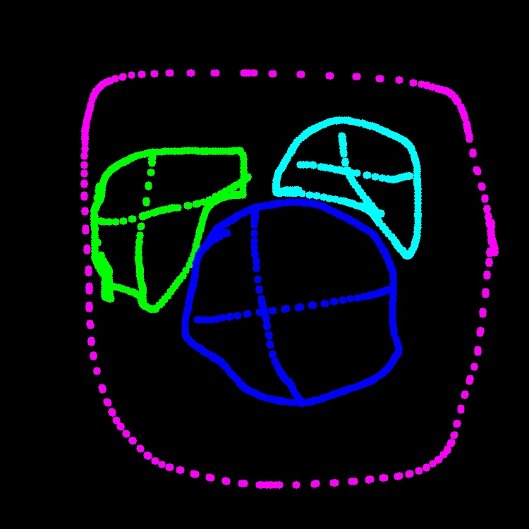
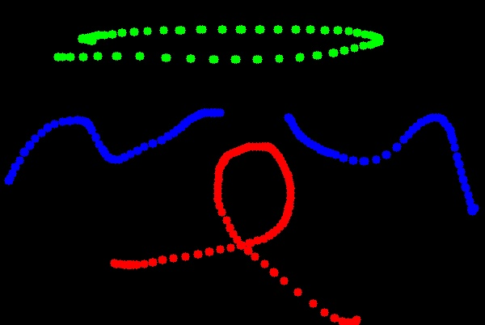

# 111590004 張意昌 MV_HW3

## Approach

> [!NOTE]  
> In this homework, our goal is using watershed algorithm to segment image.    
> There are two problems to solve in this homework.  
> In this report. I will answer each question and put original images and result for each question.  
> At the end of report. I will discuss some issue which I found in this homework.

## Original Image

> [!TIP]  
> Here is our original pictures.  
>   
> 
> 

## Problem 1 Mark the area you want to segment

> [!IMPORTANT]  
> In this problem, we need to use mouse to making mask.  
> The method is using mouse left click to make mask and number key to change the label colors.  
> After that, press Q or using right-top bottom to make mask for next picture.  
> For final processing in this problem,it will make two images here.  
> One is marked image and the other is mask image.  

### Marked Image

> [!TIP]  
> 
> 
> 

### Mask Image

> [!TIP]  
> 
> 
> 

## Problem 2 Watershed Segmentation Region growing

> [!IMPORTANT]  
> In this problem, we need to use watershed algorithm to segment object.  
> Most important thing is to choose our priority.  
### Segment Image

  
  

## My thought in hw3

> [!TIP]  
> In this section, I will discuss some interest things I found in hw3.  

# Report link

[HW2](https://github.com/kesshoban3310/NTUT_Machine_Vision/tree/main/hw3)

> [!NOTE]  
> You can see origin link for this solution.  