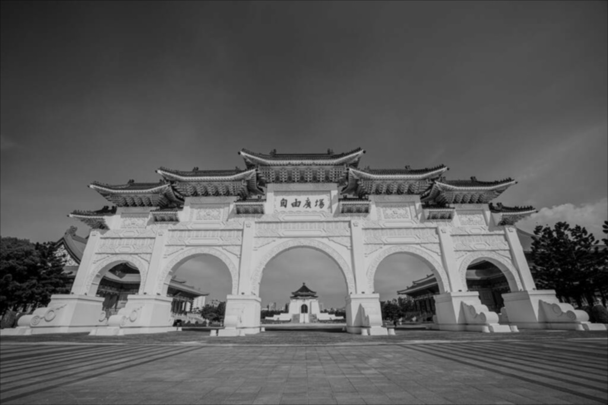
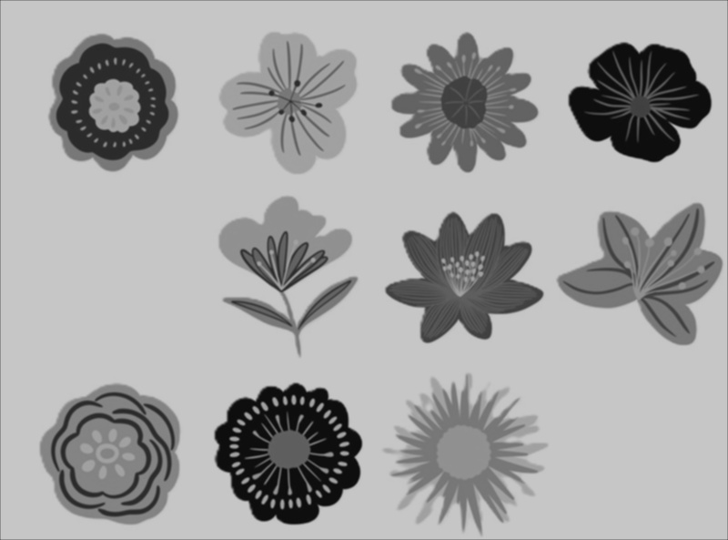
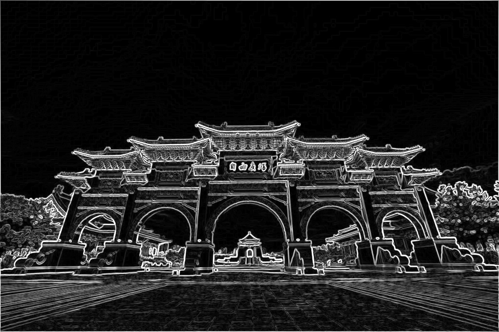
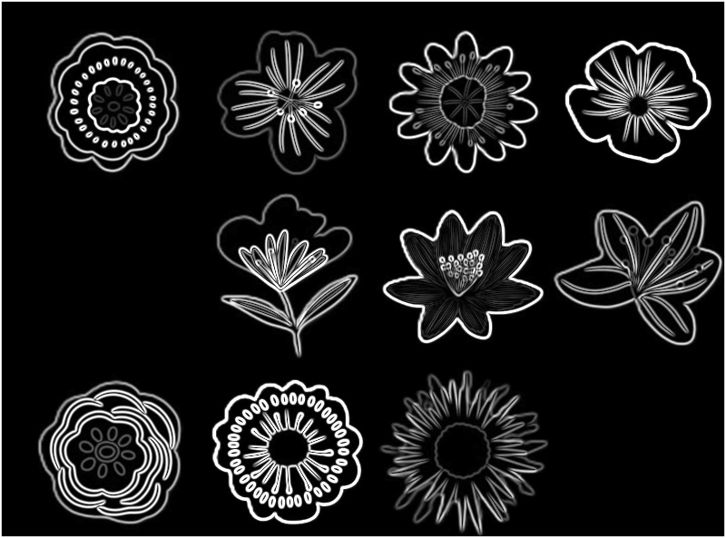
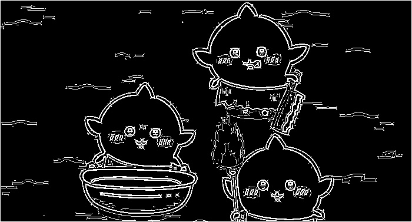
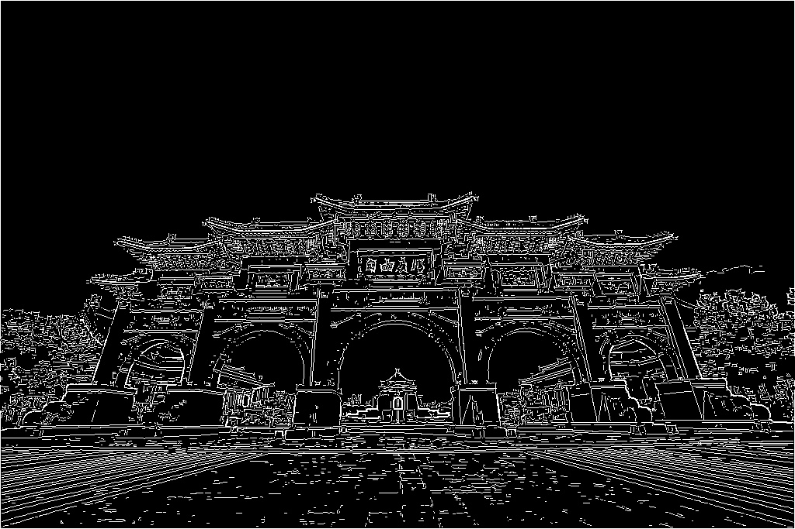
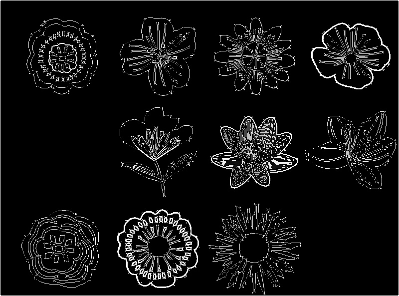

# 111590004 張意昌 MV_HW4

## Approach

> [!NOTE]  
> In this homework, our goal is doing canny edge detection.   
> There are five steps to complete in this homework.  
> In this report. I will answer each question and put original images and result for each question.  
> At the end of report. I will discuss some issue which I found in this homework.

## Original Image

> [!TIP]  
> Here is our original pictures.  
> 
> 
> 

## Step 1 Mark the area you want to segment (output gaussian blur image)

> [!IMPORTANT]  
> In the first step,we need to use gaussian filter.  
> The formula is:  
> 𝐺(𝑥, 𝑦)=1/(2𝜋𝜎^2 ) 𝑒^(−(𝑥^2+𝑦^2)/(2𝜎^2 ))  
> 𝜎 is the standard deviation (controls the amount of blur).  
> Where 𝜎 and kernel size, you need to choose by yourself.  
> x and y is the distance between the middle point.  
> I choose 𝜎 = 1.0 and kernel size is 3.  

### Gaussian Image

> [!TIP]  
> 
> 
> 

## Step 2 Find the intensity gradient of the image (output magnitude G image)

> [!IMPORTANT]  
> In this step,we need to use sobel operation separately x and y.  
> Where kernel was defined in the homework announcement.  
> And a 𝜃 graph for the slope of gradient.  

### Magnitude G Image

> [!TIP]  
> 
> 
> 

## Step 3 Non-maximum suppression

> [!IMPORTANT]  
> In this step we need to do non-maximum suppression by 𝜃 graph from step 2.  
> First, we determine the gradient angle and classify it into 
> one of the four nearest directions: 0°, 45°, 90°, or 135°.  
> Then, if the pixel has a greater value than its neighbors in the gradient direction, it is retained.  
> Otherwise set it to zero.  

## Step 4 Double threshold

> [!IMPORTANT]  
> For these step, we need to choose two thresholds.  
> One is low threshold and the other is high thresholds.  
> First, calculate the gradient magnitude for all points.    
> Next, remove zero values since they do not impact the result.    
> Finally, manually select two values as the thresholds.  

## Step 5 Edge Tracking by Hysteresis (output edge detection result image)

> [!IMPORTANT]  
> In step 4, we have already chosen two values as thresholds: low and high.  
> If a pixel's value is lower than the low threshold, it will be ignored.  
> If the value falls between the low and high thresholds, it will be labeled as a weak edge.  
> If the value is greater than the high threshold, it will be marked as a strong edge.  
> Next, we check each weak edge pixel.  
> If it has at least one neighboring strong edge, it will be upgraded to a strong edge.  
> Otherwise, it will be set to zero.  

### Result Image

> [!TIP]  
> 
> 
> 

## My thought in hw4

> [!TIP]  
> The key points of this homework are selecting the kernel size and 𝜎 in Step 1, 
> and determining the thresholds in Step 4.  
> And since the result is a binary image.  
> I have convert the test images into grayscale image first and execute these five steps.  
> One major issue in this homework is performance, as many steps involve nested loops.  
> This results in longer computation time, 
> since the program is designed to complete all steps before displaying the output.    
> Therefore, it may take approximately 1 minute to finish running the entire code.  
